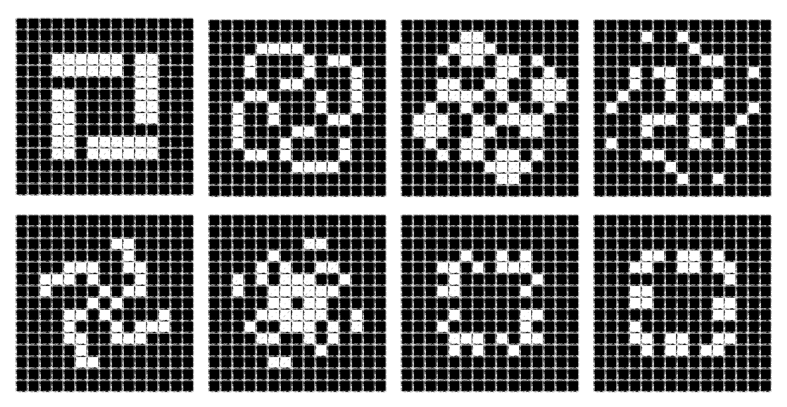

# Quantized Game of Life


## Metapixel Galaxy

A quantized game of life displaying metapixel galaxy pattern (Fig. 12 in our paper)

### How to Run

```
python galaxy.py --arch [cpu/cuda] -o [output_dir]
```

We suggest you run the script using GPU (`--arch cuda`). Because to better observe the evolution of metapixels, we set the steps per frame to be 32768 which will take quite a while on CPUs.

### Results



## Quant Sim

A super high-resolution game of life displaying letters of "QUANT SIM" (Fig. 1 in our paper)

### How to Run
1. Download the pattern `quant_sim_meta.rle` from our [Google Drive](https://drive.google.com/file/d/1kCg2fSAlQgy42cGAatVwuvGZd7RlqLF-/view?usp=sharing) and place it in the same folder with `quant_sim.py`

2. Run the code
```
python quant_sim.py -o [output_dir]
```

### Note

The pattern file for this demo contains 20B cells in Run-Length Encoding format. We use a naive serial parsing method to parse the pattern file so it may take tens of minutes to finish the pattern loading.

### Results


